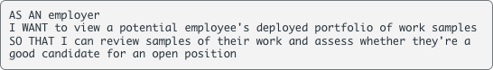
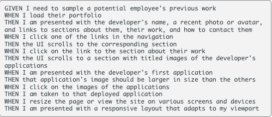

# Boot Camp Portfolio

## Description

For this challenge we were tasked with createing a portfolio page with HTML and CSS. Using what we learned this past week, a few google searches, and some help from AskBCS I was able to create a portfolio that meets the acceptance criteria below:

### User Story

### Acceptance Criteria

## Usage

Below is a gif of my portfolio page, if you click on any of the projects in the work section; they will all take you to a new tab with an empty google search, except for the Landing Page project that will take you to a deployed mini project of mine. The contact links will also open in new tabs, except the cell will ask how you would like to call the number, and the email will open a draft email with the linked email in the address line.

## License

Please refer to the LICENSE in the repo.

## Links

Deployed Page: https://anjaliroland.github.io/M2-CSS-Portfolio/

Repository: https://github.com/anjaliroland/M2-CSS-Portfolio